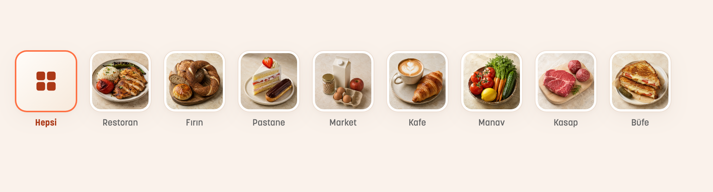

# Görsel yenileme ve uygulama kontrolü

8 Eylül 2026 · Çalışma dalı: `berkay`

## Öncelikli görev: ana sayfa kategorileri

Restoran, Fırın, Pastane, Market, Kafe, Manav, Kasap ve Büfe için sekiz ayrı, fotoğraf gerçekçiliğinde temsili görsel eklendi. Aynı sıcak ışık, açık taş zemin ve yakın çekim dili kullanıldı. Görseller yapay zekâ ile üretildi; belirli bir işletmenin gerçek ürününü temsil etmez.

84 piksel kare kartlar, yatay kaydırma, kategori sırası, kimlikler ve filtre akışı korundu. Ortak yüzey ve gölgeler, turuncu seçim kenarı ve okunaklı etiketlerle görünüm toparlandı. Büyük yazıda etiket alanı genişler; görseller cihaz ölçeğine göre en fazla 336 pikselde çözülür. Eski `firin-pastane` kayıtları Fırın fotoğrafına bağlanır; bilinmeyen kategoriler için ikon yedeği vardır.

Dosyalar: `bitir_yemek_mobile/assets/images/categories/{restoran,firin,pastane,market,kafe,manav,kasap,bufe}.webp`. Üretim yöntemi ve promptlar: [category-photography.md](category-photography.md). [Büyük yazı önizlemesi](previews/category-large-text.png).

## Genel kontrolde giderilen sorunlar

| Alan | Sonuç |
| --- | --- |
| Sipariş sonrası dönüş | “Siparişlerime Git” doğru sekmeyi ve Aktif filtresini açar. Önceden açılmış liste yenilenir; mevcut ana ekran örneği korunur. |
| Sipariş filtreleri | İlk sayfada sonuç bulunmaması sonraki siparişleri gizlemez. Boş/kısa listede sonraki sayfaya erişim vardır; geç yanıtlar yeni yenilemeyi ezmez. |
| Profil | Hesap silme reddedilince kullanıcı bilgileri korunur, hata gösterilir ve düzenlemeye devam edilir. Bekleyen silmede yinelenen işlemler engellenir. |
| Konum | GPS izni verilmeden il/ilçe/mahalle aranıp sonuç seçilebilir. Müşteri ve işletme sahibi yönlendirmeleri korunur; hata/iptal/tekrar deneme ve sayfa kapanması ele alınır. |
| Web işletme paneli | Sipariş onayı sonrası işlem düğmeleri açılır. Sipariş, paket ve değerlendirmelerin 50 kayıttan sonrası sayfalanır; filtre/işletme değişince ilk sayfa açılır. |
| Ödeme özeti ve metinler | Kuruşlar yuvarlanmaz; marka yazı tipinde okunabilen TL biçimi kullanılır. Ödeme beklerken kesin onay vaadi kaldırıldı. Dokunulan sipariş ekranlarının Türkçe metinleri düzeltildi. |
| Harita | Harita kaynağı logosu ve bilgi düğmesi açılarak alt paket panelinden ayrı bir konuma yerleştirildi. |

İlk sipariş kampanyasının 500 TL ve üzeri alışverişte 100 TL indirim koşulu ve mevcut ödeme paylaşımı korundu. Bu çalışma yeni bir canlı kampanya başlatmaz.

## Doğrulama

- Flutter: 65 test başarılı; genel statik analizde sorun yok. Kategori, konum, profil kurtarma, sipariş sayfalama ve dönüş akışları için 24 yeni test dahil.
- Küçük ekran ve büyük yazı: kategori şeridi 320 piksel genişlikte 2,4 kat yazıyla; ilgili diğer ekranlar 2 kat yazıyla kontrol edildi.
- Web: 13 test başarılı; TypeScript, değişen dosyalarda ESLint ve production build başarılı.
- VS Code üzerinden çalışan iPhone 17 Pro simülatöründe sekiz fotoğraf, kategori seçimi ve harita görünümü kontrol edildi.
- Son Türkçe metin düzenlemesinden sonra sipariş sayfalama ve tasarım testleri yeniden çalıştırıldı.

## Yayın öncesi kalan doğrulama sınırı

Bu sonuç yerel geliştirme ortamı, otomatik testler ve iOS simülatörüne dayanır. Gerçek ödeme/iade, gerçek e-posta ve push teslimatı, fiziksel Android/iOS cihazları ve mağaza yayını bu çalışmada uçtan uca doğrulanmadı. Bu nedenle “canlı yayına tamamen hazır” onayı verilmez. Yeni değişiklikler yereldedir; bu çalışma kapsamında push veya dağıtım yapılmadı.

Web testleri için yalnız geliştirme bağımlılığı olarak `react-test-renderer` eklendi. Aracın kullanımdan kaldırılma uyarısı ve Next'in mevcut middleware uyarısı derlemeyi engellemiyor.
